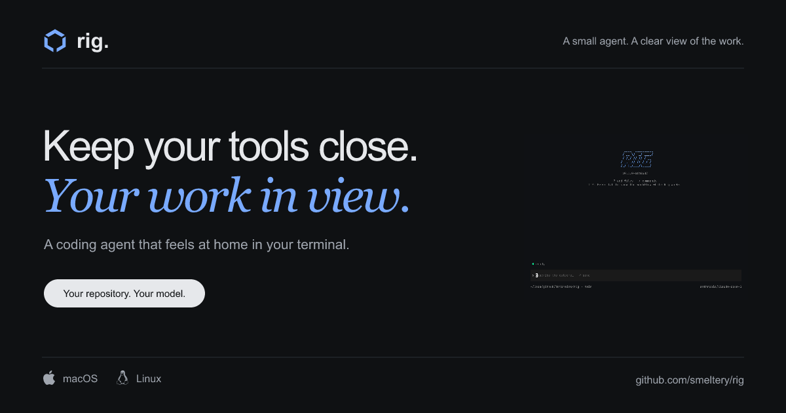

<!-- markdownlint-disable-next-line MD033 -->
#  rig

[](docs/README.md)

[](https://github.com/smeltery/rig/actions/workflows/ci.yml)
[](https://github.com/smeltery/rig/releases)
[](go.mod)
[](package.json)
[](.flox/env/manifest.toml)
[](.pre-commit-config.yaml)
[](LICENSE)

A small Go coding agent for your terminal. Rig works in your repository, follows
`AGENTS.md` and reusable skills, and keeps the plan, tool activity, and delegated
work visible while you build.

- **Your provider:** Anthropic, OpenAI, Google Gemini, or OpenRouter.
- **Your workflow:** interactive chat, headless runs, saved sessions, and
  `/design`, `/plan`, `/build`, `/review` prompts.
- **Your environment:** one native binary; run it inside your chosen VM or
  sandbox to control filesystem, process, network, and credential access.

## Start

```sh
curl -fsSL https://raw.githubusercontent.com/smeltery/rig/main/install.sh | bash
export ANTHROPIC_API_KEY="your-key"
cd your-project
rig
```

See [installation](docs/install.md) for checksums and pinned versions, or the
[quick start](docs/quick-start.md) for other providers and subscription login.

## Explore

[Documentation](docs/README.md) · [Workflows](docs/guides/workflows.md) ·
[Configuration](docs/reference/config.md) · [Troubleshooting](docs/guides/troubleshooting.md)

## Develop

```sh
flox activate
just setup
just check
```

[Development guide](docs/development.md) · [Architecture](docs/reference/architecture.md) ·
[Website and Vercel](docs/operations/website.md)

[PolyForm Shield License 1.0.0](LICENSE) · Made by [Smeltery](https://github.com/smeltery).
