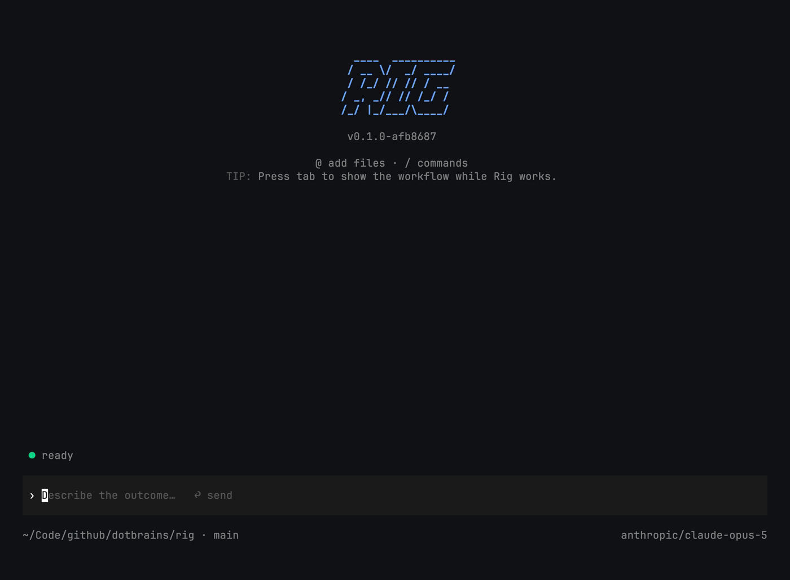

# rig



[](https://github.com/smeltery/rig/actions/workflows/ci.yml)
[](LICENSE)
[](go.mod)
[](.pre-commit-config.yaml)
[](https://flox.dev)

rig is a minimalist coding agent harness and orchestrator that works where
engineering happens: in your repository, with your project instructions,
tools, and git history.

Start it in a project and rig keeps the plan, tool activity, tests, and
delivered diff visible in one terminal instead of buried in a chat log.

```console
$ cd ~/dev/my-service
$ rig
rig> Find the cause of the failing test, plan the fix, implement it, run the
     relevant checks, and review the final diff.
```

## Why

- Visible by default — see the plan, active work, tool activity, tests, and
  delegated tasks without reading a wall of chat.
- One coordinator, focused workers — delegate bounded work to subagents and
  bring their evidence back into one coherent workflow; independent reads,
  searches, and inspection subagents run in parallel.
- Your model, your choice — Anthropic, OpenAI, Google Gemini, or OpenRouter,
  switchable per session without leaving the terminal.
- Sandbox-first execution — let the runtime contain tools, and confirm
  selected interactive tool calls; steer active work or queue the next
  instruction at any time.
- A small, dependable foundation — one native Go binary, built-in tools, local
  sessions, no runtime or plugin stack, and no product telemetry.

## Install

rig is a single self-contained binary. The short path is:

```sh
curl -fsSL https://raw.githubusercontent.com/smeltery/rig/main/install.sh | bash
```

The installer downloads the matching GitHub release for your host, verifies
its SHA-256 checksum, and installs it to `~/.local/bin/rig` by default. See
[the install guide](docs/install.md) for version pinning and custom install
directories.

Connect a model — rig uses Anthropic by default:

```sh
export ANTHROPIC_API_KEY="sk-ant-..."
```

Prefer OpenAI, Gemini, or OpenRouter? See the
[quick start guide](docs/quick-start.md) for API keys, ChatGPT/Codex
subscription login, and the `rig.yaml` config.

```sh
rig doctor
```

## Common Workflows

Start rig in a repository:

```sh
cd your-project
rig
```

Run the CLI's other subcommands:

```sh
rig chat      # start a chat session (default)
rig sessions  # list and resume previous sessions
rig login     # authenticate a ChatGPT/Codex subscription
rig doctor    # check config, provider auth, and session storage
```

Make the workflow yours: rig follows repository instructions from `AGENTS.md`
and reusable skills from `.rig/skills/`. Define how your team plans, tests,
reviews, and ships once, then let every task follow the same process.

rig also ships with focused `/design`, `/plan`, `/build`, and `/review`
phases. Each phase is a named prompt shown in the workflow UI for that turn.
Add or override phases through `rig.yaml` without installing a skill.

## Configuration

Project settings live in `./rig.yaml`. Global settings live in
`~/.rig/config.yaml`. The first file found wins — config files are not merged.

```yaml
provider: anthropic
model: claude-opus-5
```

See [internal/config/defaults/rig.yaml](internal/config/defaults/rig.yaml) for
every documented option: provider selection, OpenAI auth mode, subagent
provider/model overrides, and tool approval prompts.

## Subprojects

| Path | Description |
|------|-------------|
| [`cmd/rig`](cmd/rig) | CLI entry point: flag parsing, provider wiring, and the `rig` binary's subcommands (`chat`, `sessions`, `login`, `doctor`, ...). |
| [`internal/*`](internal) | The 16 packages that implement the agent: `agent` (policy-free agent loop), `llm` (provider clients), `tools`, `tui`, `workflow`, `phase`, `skills`, `session`, `config`, `auth`, `approval`, `compact`, `factory`, `workspace`, `projectctx`, `atomicfile`, and `logx`. |

## Docs

- [Install](docs/install.md) and [quick start](docs/quick-start.md) — get
  from a fresh install to your first chat.
- [Reference documentation](docs/reference/index.md) — architecture,
  configuration, sessions, tools, and the CLI.
- [Architecture overview](ARCHITECTURE.md) — a from-source description of how
  the pieces fit together.
- [Docs index](docs/README.md) — the full documentation map, including
  guides and operations.

## Development

```sh
go build -o rig ./cmd/rig
go run ./cmd/rig
```

This repository uses [`just`](https://github.com/casey/just) as its command
runner:

```sh
just build            # build the rig binary (stamps the version)
just dev              # run rig in dev mode
just test             # run the test suite
just test-verbose     # run tests with verbose output
just lint             # go vet + golangci-lint
just fmt              # gofmt the whole tree
just install          # install rig onto a runnable PATH directory
just performance      # build the release-shaped binary and run microbenchmarks
```

With [Flox](https://flox.dev) installed, `flox activate` provides the pinned
Go toolchain used by CI, so `just build` and `just test` behave the same
locally as they do in CI.

Start with the [reference documentation](docs/reference/index.md) before
changing the agent loop, providers, tools, or TUI.

[PolyForm Shield License 1.0.0](LICENSE).
