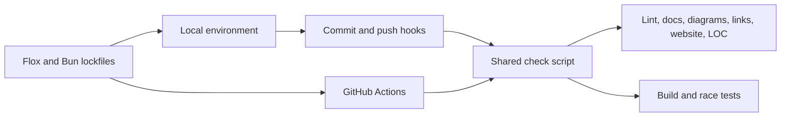

# Development

Read the [reference index](reference/index.md) before changing runtime behavior.
Keep the relevant documentation current with code changes.

## One environment for local work and CI

Install [Flox](https://flox.dev), then run:

```sh
flox activate
just setup
just check
```

The committed `.flox/env/manifest.lock` resolves Go, Bun, Just, Git, pre-commit,
golangci-lint, ShellCheck, and actionlint for Linux and macOS. Go's `go.mod`
selects the minimum language/toolchain version. Bun's `bun.lock` pins the docs
and website dependencies; Bun is development tooling, not a Rig runtime
requirement. The first setup also downloads Chromium into `.flox/cache/puppeteer` to render Mermaid.

Activation only enters the environment. `just setup` explicitly installs the
locked dependencies and pre-commit/pre-push hooks. This keeps activation free of
network and repository mutations after Flox has provisioned its environment.



## Commands

| Command | Purpose |
| --- | --- |
| `just build` | Build the version-stamped `rig` binary |
| `just dev` | Run the CLI from source |
| `just test` | Run Go tests |
| `just check` | Run all CI checks locally |
| `just docs` | Lint Markdown, check relative paths, render Mermaid |
| `just website` | Build the website into `dist/` |
| `just preview` | Serve the website locally |
| `just performance` | Run the performance baseline |

The commit hook runs quality checks; the push hook builds and runs race tests.
Both call `scripts/check.sh` through Flox, exactly as CI does. Linux and macOS
CI test the platform-dependent behavior. To run both hooks manually:

```sh
pre-commit run --all-files
pre-commit run --all-files --hook-stage pre-push
```

## Keep changes small

The LOC check caps Go and shell files at 1,000 lines, retaining two documented
legacy exceptions. Website source and TypeScript tooling have a 300-line cap per file and a combined 1,800-line budget.
Split by responsibility; do not minify source or exclude new files to evade the
budget. Generated output, lockfiles, and dependencies are excluded. Prefer the
standard library and small static assets over new runtime dependencies.

## Dependency updates

Use `flox upgrade` to refresh environment resolutions, or edit the manifest
and run `flox list` to resolve it. Review and commit the manifest and lockfile
together. After changing JavaScript dependencies, run `bun install`, commit
`bun.lock`, and run `just check`.

See [website maintenance](operations/website.md) and
[releasing](operations/releasing.md) for publishing workflows.
