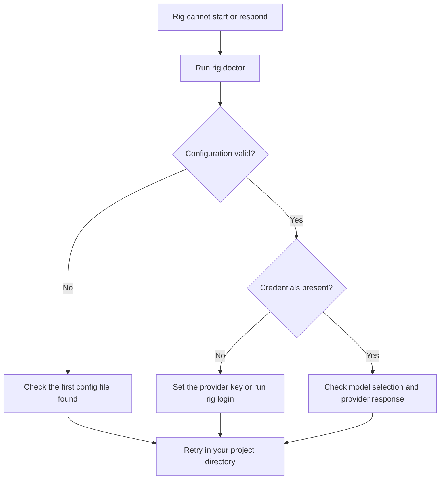

# Troubleshooting

Start with `rig doctor`. It checks configuration, credential presence, session
storage, Git, and workspace readiness locally, without calling a model provider.

## Settings seem to be ignored

Rig reads `./rig.yaml`, then `~/.rig/config.yaml`, then its embedded defaults.
The first file found wins; files are not merged. Check for a project config
before editing global settings. See [configuration](../reference/config.md).

## Authentication fails

Use the key for the configured provider: `ANTHROPIC_API_KEY`, `OPENAI_API_KEY`,
`OPENROUTER_API_KEY`, or `GOOGLE_API_KEY`. OpenAI subscription authentication
requires `openai_auth: subscription` and `rig login`; an API key uses
`openai_auth: api_key`. See the [quick start](../quick-start.md).

Do not put credentials in issue reports, project instructions, or committed
configuration files.

## A resumed chat opens in the wrong directory

Rig tries the saved working directory. If it no longer exists, Rig warns and
stays in the current directory. Restore the directory or start a new chat from
the intended project.

## Tool output is concise

Rig shows concise receipts by default. Set `output.verbose: true` in the active
config to show full tool cards. Oversized tool results are still capped before
they enter the model transcript.

## Report a reproducible problem

Include `rig version`, operating system, the command or interaction that failed,
and a minimal example with secrets removed. Report it through
[GitHub issues](https://github.com/smeltery/rig/issues).
