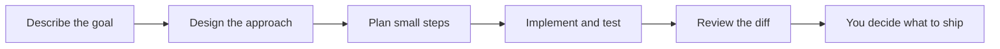
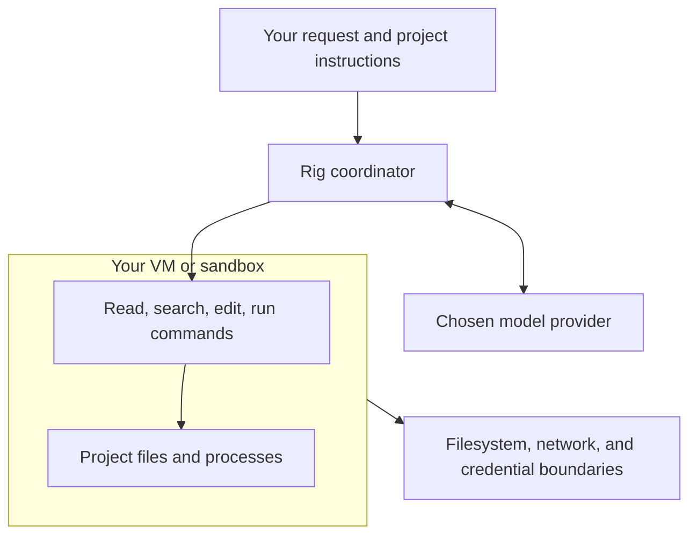

# Working with Rig

Start Rig from the repository you want to change. Give it an outcome and the
checks that will prove it worked; the terminal shows tool activity and progress.

## From a question to a reviewed change



The four built-in phases are prompts, not an automatic pipeline. Invoke each
when it helps; a normal chat request works too.

```text
/design Add a CSV export without changing the existing JSON API.
/plan Implement the agreed design and include error handling checks.
/build Follow the plan and run the relevant tests.
/review Check the diff for regressions and unnecessary complexity.
```

Rig can delegate bounded tasks to child agents. Give independent investigations
clear scopes, and ask the coordinator to bring the results together. Inspection
children have read-only tools; execution children can change the workspace.

## Carry your project conventions with you

Put build commands, review expectations, and coding conventions in `AGENTS.md`.
Reusable instructions belong in skills under `.rig/skills/`. See the
[system prompt guide](../reference/guides/system-prompt.md) for how instructions
and skills enter the conversation, and [named phases](../reference/phases.md)
for adding your own slash commands.

## Return to unfinished work

```sh
rig sessions
rig sessions search "CSV export"
rig resume <id>
```

Interactive conversations are saved locally after each turn. Resuming restores
the conversation and attempts to return to its original working directory.
See [sessions](../reference/sessions.md) for storage details.

## Use Rig in scripts

```sh
rig run --json "Inspect the failing tests and summarize the likely cause."
cat review-notes.txt | rig run "Summarize these review notes."
```

Headless runs have a default ten-minute timeout and do not persist sessions.
They have the standard tool registry and can execute commands. Use a VM or
sandbox with the access boundaries appropriate for the task.

## Keep execution boundaries explicit



Rig does not provide a sandbox. Optional `tool_approvals` add interactive
confirmation for selected coordinator calls; they do not apply to headless or
child agents. [Sandboxing and approvals](../reference/guides/permissions.md)
explains the distinction.
